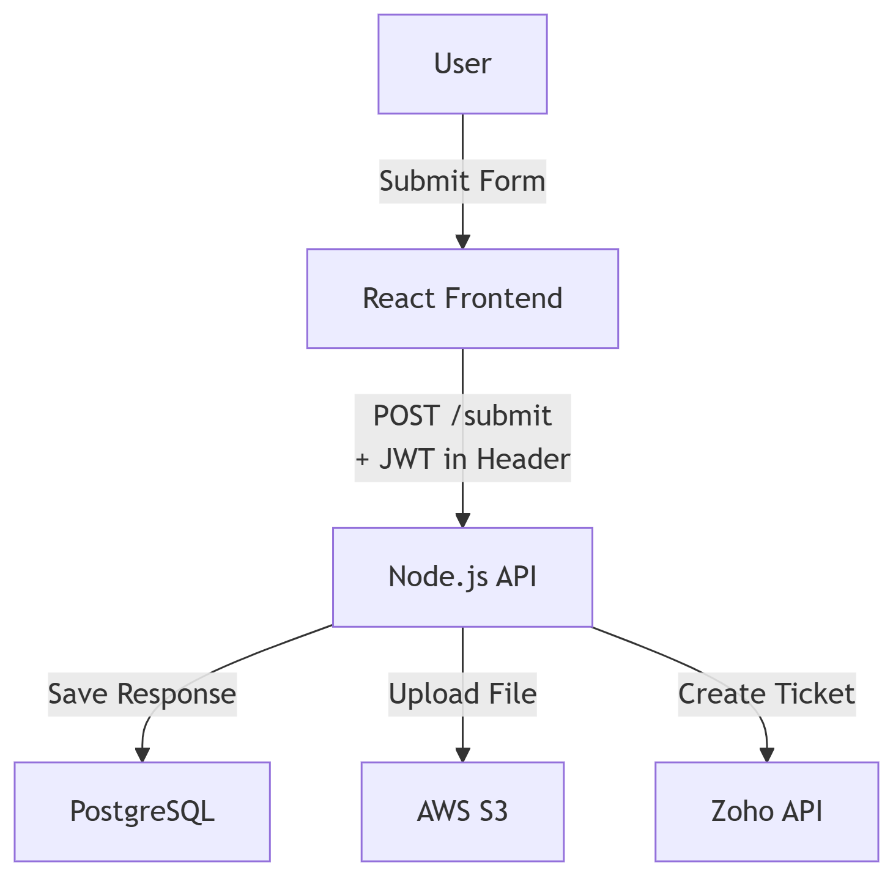

# Full Stack Engineer — Technical Exercise Submission 
**Artur Tereshchenko**  
Ottawa, ON  
mr.arturio@gmail.com  
204-881-7817  
[LinkedIn](https://www.linkedin.com/in/arturtereshchenko/)
---
## 1. Task Breakdown & Timeline

This project will involve building a dynamic, decision-tree-based workflow tool with file uploads and Zoho integration.

### Assumptions
- Final UI/UX design and decision-tree logic will be provided.
- Zoho API access and documentation is available.
- The app will initially target web only (not mobile).
- Basic authentication (JWT) is expected, but no user roles are required initially.

### Project Phases

#### **Phase 1: Planning & Setup** *(1 day)*
- Confirm project requirements and scope
- Set up Git repo, CI/CD pipeline, and initial boilerplate (Next.js + React, Node.js/Express or FastAPI)

#### **Phase 2: Frontend** *(5–6 days)*
- Build form engine to render branching questions based on decision-tree data *(2 days)*
- Implement conditional logic and validations *(1–2 days)*
- Media uploader (image/video) with preview and progress *(1–2 days)*

#### **Phase 3: Backend & API** *(4–5 days)*
- Create RESTful API for form logic and user submissions
- File upload endpoint with validation and storage (e.g., AWS S3 or local fallback)
- Endpoint to push form data to Zoho Tickets via API
- Add JWT-based authentication

#### **Phase 4: Database Design & Integration** *(2 days)*
- Design schema to store form definitions and user responses
- Seed a basic decision-tree in the database
- Connect with frontend and backend

#### **Phase 5: Testing & QA** *(2–3 days)*
- Write unit tests for frontend components (Jest)
- API and integration tests (Jest + supertest or Pytest)
- Manual QA testing

#### **Phase 6: Deployment & Handoff** *(1 day)*
- Deploy frontend (Vercel/Netlify) and backend (Render/Fly.io/Heroku)
- Create handoff documentation (README + API docs)

**Total Time Estimate: ~15 working days (3 weeks)**

---

## 2. Architecture

### Tech Stack
- **Frontend:** React (or Next.js), TypeScript, Tailwind CSS, React Hook Form, Axios  
- **Backend:** Node.js with Express (or FastAPI if using Python)  
- **Auth:** JWT (stored in HttpOnly cookies or localStorage)  
- **Storage:** AWS S3 (media), local fallback in development  
- **Database:** PostgreSQL  
- **Integration:** Zoho API (REST)  
- **Deployment:** Vercel (frontend), Render or Fly.io (backend), Railway (PostgreSQL)

### Key Endpoints

| Endpoint         | Description                                 |
|------------------|---------------------------------------------|
| `GET /form`      | Fetches form definition and decision logic  |
| `POST /submit`   | Submits user input + media                  |
| `POST /upload`   | Handles secure media uploads                |
| `POST /zoho/ticket` | Creates a Zoho ticket with user data     |
| `POST /auth/login` | (Optional) Internal user login            |
---
## [PostgreSQL Database Schema](./schema.sql)

---

## 3. Cost Estimate

- **Hourly Rate:** 45 CAD/hour  
- **Estimated Hours:** 80–100  
- **Total Cost Estimate:** **$3,500 – $4,500 CAD**

*Scope-dependent factors may increase cost, such as complex decision trees or deep Zoho workflows.*

---

## 4. Conditional React Form Sample

Here’s a small React component with conditional branching and media upload input:

## [Code Exapmle](./SupportForm.js)

## Secure Upload Strategy
- Client-side file type and size checks (before submission)
- Backend scan with antivirus or use pre-signed S3 upload URLs
- Store only file metadata in DB, files in cloud storage
- Use a secure CDN for media playback (if needed)
---
### Architecture diagram

___

## [Download my Resume](./Artur-Tereshchenko-Resume.pdf)